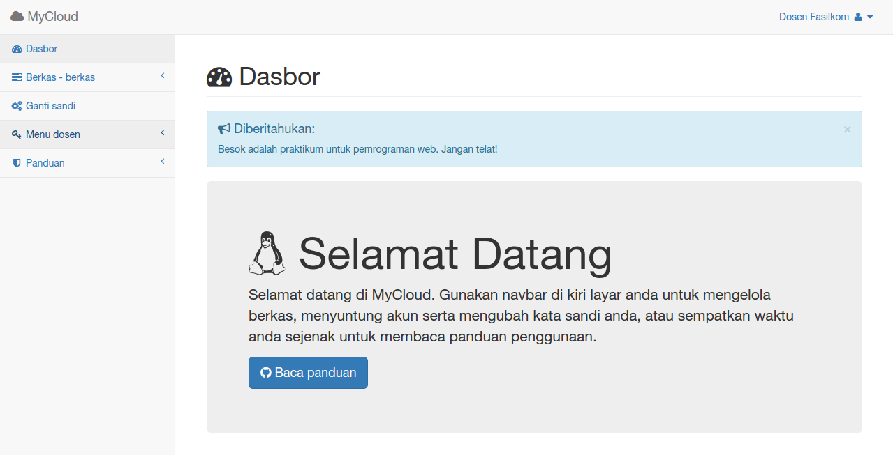

# mycloud

Program ini adalah program semacam filehosting sederhana.
Program ini dibuat dengan tujuan memudahkan pengelolaan berkas tugas praktikum di laboratorium komputer kampus saya. Program masih banyak bug, baik yang telah atau belum diketahui.
Program ini adalah proyek ini _iseng - iseng_ untuk latihan latihan pemrograman.

### Harapan saya
Saya berharap program ini dapat dikembangkan hingga benar - benar layak untuk digunakan di lingkungan labkom kampus saya. Amin!
Untuk teman - teman, bantu fork atau pull-request ya!

## Kebutuhan Program
+ Webserver (apache/nginx/lighttpd)
+ PHP versi 4.3 keatas
+ MySQL

## Instalasi
  + Ekstrak dan unggah semua berkas ke webserver
  + chmod `0777` direktori `berkas` dan sub-direktorinya
  + Impor database `db/mycloud.sql` ke phpmyadmin
  + Login admin:
    - email: `dosen@staff.unsika.ac.id`
    - password: `12345`
    - untuk akun mahasiswa nanti buat saja lewat menu dosen.

## Peringatan
Script ini belum selesai dan masih sangat banya bugs. Pengembangan masih terus dilakukan.

## Kekurangan yang diketahui
+ Belum ada paging pada halaman :
  dosen -> list akun
  berkas -> list berkas
Sehingga jika data banya pasti loading halaman akan angat berat karena langsung ditampilkan seluruh data
+ Belum ada fitur sortir akun dan berkas
+ Belum ada fitur pencarian

### Terimakasih
+ SB Admin 2 themes ([http://startbootstrap.com](http://startbootstrap.com))
